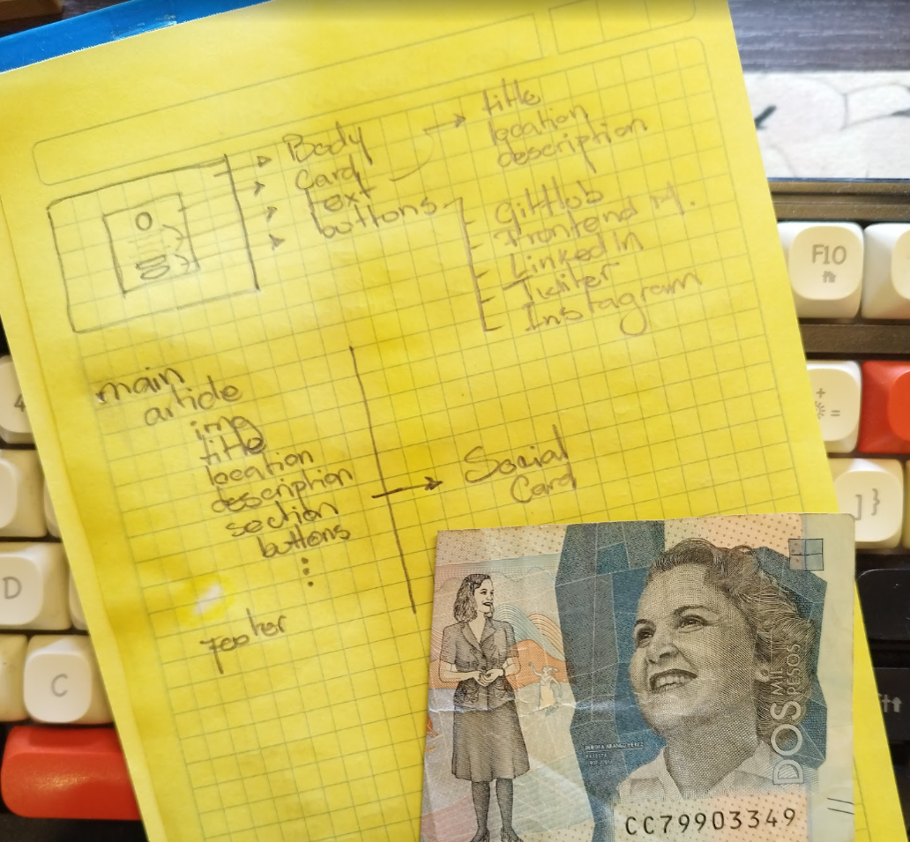

# Frontend Mentor - Social links profile solution

This is a solution to the [Social links profile challenge on Frontend Mentor](https://www.frontendmentor.io/challenges/social-links-profile-UG32l9m6dQ).

## Table of contents

- [Overview](#overview)
  - [The challenge](#the-challenge)
  - [Links](#links)
- [My process](#my-process)
  - [Built with](#built-with)
  - [What I learned](#what-i-learned)
  - [Continued development](#continued-development)
  - [AI Collaboration](#ai-collaboration)
- [Author](#author)

## Overview

This is my solution to the **Social links profile** challenge on Frontend Mentor.

The goal of this project was to build a clean, responsive layout that matches the provided design perfectly. While working on this challenge, my main focus was moving away from random design choices and mastering a strict, organized **CSS Design System**—specifically utilizing a **Design Token Vault** with **Primitive and Semantic abstractions** to ensure systemic resiliency.

I built this project with a mobile-first approach, ensuring that the layout looks professional and scales correctly on screens of any size while maintaining full accessibility for all users.



### The challenge

Users should be able to:

- See hover and focus states for all interactive elements on the page.
  - **Implementation Note:** These states are defined using the `.social-card__btn:hover` and `:focus-visible` selectors in my CSS, ensuring both mouse and keyboard users receive clear visual feedback.

```css
/* --------------
    HOVER STATE ↓
  --------------- */
.social-card__btn:hover,
.social-card__btn:focus-visible {
  background-color: var(--clr-green);
  color: var(--clr-grey-700);
  transition: var(
    --tr-entry
  ); /* Snappy active state change when the mouse enters  */
}

.attribution a:hover,
.attribution a:focus-visible {
  border-radius: var(--br-attribution);
  background-color: var(--clr-green);
  color: var(--clr-grey-700);
  transition: var(
    --tr-entry
  ); /* Snappy active state change when the mouse enters  */
}

/* --------------
    HOVER STATE ↑
  --------------- */
```


_(Visual demonstration of the interactive hover/focus states described above)_

### Links

- Solution URL: [GitHub](https://github.com/ezra1492/frontend-mentor-social-links)
- Live Site URL: [gh-pahes](https://ezra1492.github.io/frontend-mentor-social-links/)

## My process


### Built with

- Semantic HTML5 markup
- CSS custom properties (Design Token Vault)
- Flexbox (Magnetic Containment)
- Mobile-first workflow
- BEM Methodology (Block-Element-Modifier)

### What I learned

During this project, I refined the architectural foundations of my CSS and interaction logic.

#### Key Takeaways:

- **Easier Clicking:** I learned to make links expand to fill their entire container (using `display: block`), so the whole button is clickable, not just the text.
- **Professional Feel:** I used "asymmetric timing," meaning the button reacts instantly when you touch it but fades back slowly when you leave, making the app feel more responsive and polished.

#### Technical Deep Dive:

##### 1. Layered Spacing: Primitives and Semantics

I perfected the use of **Primitive spacing** as a "tape measure" or a _tatami_ mat (the base unit). **Semantic spacing** represents functional roles—the width of a door, the height of a window, or the dimensions of a room.

- A small study (3 tatamis).
- A tea room (4.5 tatamis).
- A living room (8 tatamis).
  By tying all semantic roles to primitive measures, systemic maintenance becomes effortless.

```css
:root {
  /* Primitive: The raw unit */
  --sp-100: 0.5rem;
  /* Semantic: The functional role */
  --br-btn: var(--sp-100);
}
```


##### 2. Layout Dynamics: Block-level Links

I reinforced my understanding of element behavior within the box model.
**Lists:** To remove bullet points from an unordered list, the `list-style-type` property must be assigned directly to the `ul` element.
**Gas Expansion:** Links are inline by default and lack the "ceiling" and "walls" required to exert force. By converting them to `display: block`, they expand to fill the parent container's width like a gas, creating a robust, predictable hit area.

```css
.social-card__links {
  display: flex;
  flex-direction: column;
  gap: var(--sp-200);
  list-style-type: var(--lst-ul); /* remove bullet points */
}

.social-card__btn {
  display: block;
  padding: var(--pd-btn);
  font-size: var(--fs-14);
  font-weight: var(--fw-600);
  background-color: var(--clr-grey-700);
  color: var(--clr-white);
  border-radius: var(--br-btn);
  text-decoration: var(--td-btn);
}
```


##### 3. Asymmetric Interaction Timing

I implemented a professional "hydraulic" interaction feel.
**The Entry:** A snappy, immediate transition is assigned to the `:hover` and `:focus-visible` states.
**The Exit**: A slower, elegant return transition is assigned to the base rule (the "mother rule"), ensuring a smooth fade-out when the interaction ends.

```css
.social-card__btn {
  transition: all 0.5s ease-in-out; /* The slow Exit */
}

.social-card__btn:hover {
  transition: all 0.1s ease-out; /* The snappy Entry */
}
```

### Continued development

In future projects, I intend to refine my command of the following areas:

- **Flexbox Mastery:** While I have established a solid foundation in "Magnetic Containment" and viewport orchestration, I want to further explore complex alignment patterns and flexible layouts to ensure total control over responsive designs.
- **Advanced List Properties:** I plan to dive deeper into the varied properties of list containers and items, particularly regarding how they interact with accessibility markers and unconventional layout structures.
- **Dynamic Interaction & Transitions:** Building on my work with asymmetric timing, I aim to perfect my use of transitions and animations to create more sophisticated and tactile user experiences.

### AI Collaboration

I used NotebookLM to create an iterative feedback loop and establish a professional architectural framework.

- **Architecture:** Followed an "Outside-In Property Sort Rule" (Layout → Box Model → Typography → Visuals) for predictable CSS.
- **Workflow:** Adopted Conventional Commits and Gitmojis to make the repository history legible and intent-driven.
- **Documentation:** Utilized "swimming pool lanes" (comment blocks) to document the why behind technical choices, ensuring the code remains self-documenting.
- **Audits:** Conducted AI stress-tests on the "Design Token Vault" and validated BEM naming to prevent style leaks.

## Author

- Frontend Mentor - [@ezra1492](https://github.com/ezra1492)
- X / Twitter - [@RayG1492](https://x.com/RayG1492)
- Discord - `rayg._86220`
